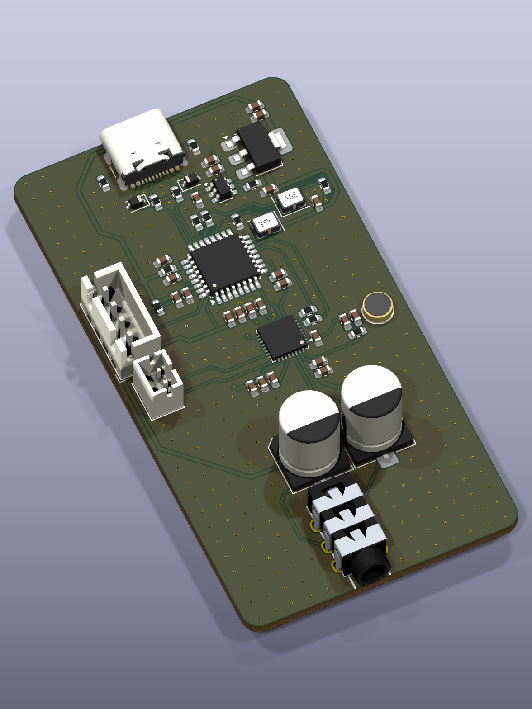

# 封装关联与原始 3D 模型补齐

2026-10-03 使用 KiCad 10.0.5 核对正式工程的 54 个实体器件，完成剩余关联，并用原始 CAD 替换此前生成的简化参考模型。

## 完成的修改

- C97、C98、C99、C100 的封装本身已经存在且与原理图选型一致，但原 PCB 缺少对应符号的 UUID 路径。本次补齐四条关联。
- Y1、Y2 使用 Abracon ASE 原厂 STEP，MIC1 使用当前封装关联的立创原库 STEP；这些下载文件未作修改。
- CN2 按用户确认的五脚版本保留现有五个金属插脚孔与两个定位孔。取得的原厂、原库 CAD 都有六个金属插脚，因此绑定立创原库的五脚适配模型：只切除多余中部插脚在安装面以下的部分，保留主体及触点细节，另存未经修改的六脚原库文件。适配文件不标为原厂五脚 CAD。
- MIC1、CN2 的项目封装库同步保存模型路径。Y1、Y2 使用项目库中的同名振荡器封装，焊盘及图形保持原样，后续更新封装时也能保留模型引用。
- 新增模型使用 `${KIPRJMOD}` 相对引用，文件随仓库保存。其余 50 个器件使用 KiCad 10 标准 3D 库。

详细来源、坐标偏移及适配范围见 [模型说明](../../../pcb/WM8978.3dshapes/README.md)。

## 验证结果

| 检查 | 结果 |
| --- | --- |
| 原理图封装字段、库文件、PCB 封装标识及符号关联 | 54 / 54 通过 |
| PCB 3D 模型路径 | 54 / 54 文件存在 |
| 三个原始 STEP 的字节与下载 SHA-256 比较 | 相同 |
| 三个原始 STEP 和一个五脚适配 STEP 重新读入 | 全部有效 |
| KiCad 原生 3D 渲染、整板 STEP 导出 | 成功，已检查显示与方向 |
| 整板 STEP 中 MIC1 / CN2 的板下金属引脚截面 | 2 / 5 根，与现有钻孔对齐 |
| 整板 STEP 中 ASE、CN2 的安装高度 | 正确 |
| 原理图完整网络及引脚集合与修改前比较 | 相同 |
| 35 项关键电路拓扑检查 | 全部通过 |
| 原生 ERC | 0 错误、0 警告 |
| 原生 DRC 未连接项 / 原理图一致性问题 | 0 / 0 |

模型替换以本地 KiCad 最新存档（2026-10-03 02:13:00，历史提交 `3530e5bf584c00aeff92c27b3be9be7ed7e63d87`）为布局基线。与该存档比较，全部原生几何相同：54 个封装、254 段走线、285 个过孔、3 个铺铜/禁铺铜区。文件语义比较确认，最新存档中的模型绑定、焊盘、网络、布线、板框、铺铜与工程规则均完整保留。此前的模型替换只修改 Y1、Y2、MIC1、CN2 的模型引用和偏移。

该最新存档相对上次 GitHub 提交已调整 C97、C98 的 X 坐标（分别从 127.76、126.25 mm 改为 129.00、127.49 mm），并将 R71 的 X 坐标从 123.25 mm 改为 124.75 mm，调整其 +3V3、SWCLK 走线及铺铜填充。这些已有布局调整一同保留。原理图相对上次 GitHub 提交仅改动 Y1/Y2 的封装库名称。

当前 DRC 仍有原先的 402 个错误、3 个警告，各类型及严重程度的计数与上次检查相同。关联及模型补齐不代表制造检查已经清零；原有规则与孔距、丝印事项见 [PCB 复核](../../pcb-review/2026-10-02-recheck-2347/review.md)。



## 检查记录

- [封装关联](binding-audit-after.json)、[3D 模型路径](models-audit-after.json)
- [原始模型来源](original-model-sources.json)、[CAD 与原生整板 STEP 验证](original-model-validation.json)
- [五脚适配检查](five-pin-adaptation.json)、[模型绑定变更](model-binding-changes.json)、[修改范围验证](verification.json)
- [ERC](erc.json)、[DRC](drc.json)、[关键拓扑](topology-check.json)
- [原生网表](netlist.xml)、[几何数据](geometry.json)

源文件 SHA-256：

```text
PCB: 5fb48f70224364015cf48c9607fd8780e6c241d2294cacb238a3a9f37e3e6dfc
SCH: ec997bf1890f5b327d74b67f1542f2626916010a5ec2dfd338209763c5ab9a2f
```
