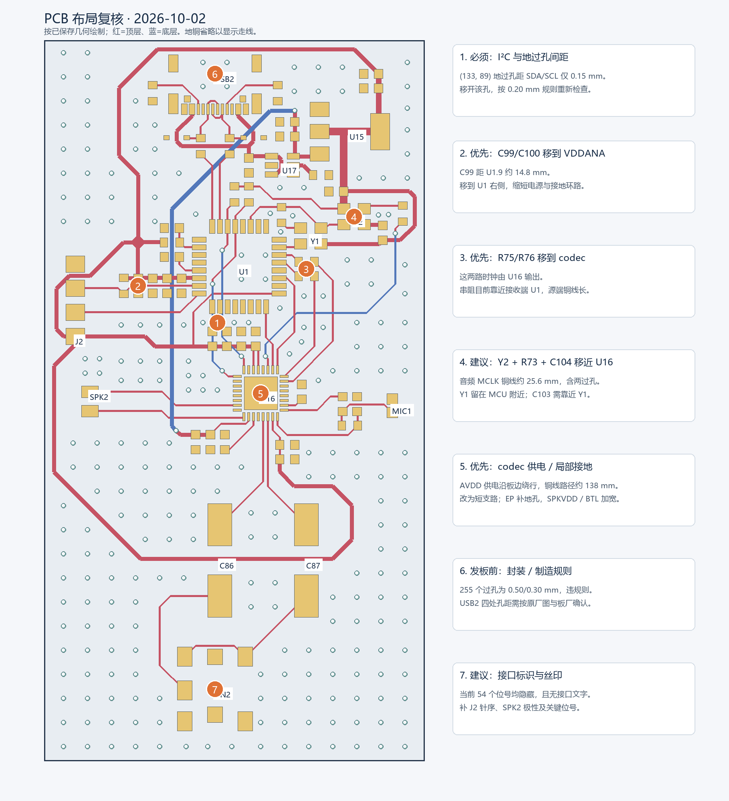

# PCB 布局复核 — 2026-10-02

整体分区可保留，建议完成下列局部调整及制造规则核对后再发板。USB/电源在上方、MCU 居中、codec 与模拟输入输出在下方的方向合理；底层保留了大面积 GND，连接已完成。主要问题集中在去耦和时钟外围的摆位、过长的电源路径、过孔规则及接口标注。

本次仅检查及生成报告，未写入 PCB、原理图或工程设置。Windows 当前没有可检查的 KiCad 编辑窗口，因此依据磁盘上正式工程文件检查，没有确认任何未保存的编辑内容。

图中位置来自 `pcbnew` 对实际 PCB 的读取。红色为顶层走线，蓝色为底层走线；为显示走线路径，复核位置图省略了地铜，焊盘以简化外形表示。原生 KiCad 含地铜导出图见 [顶层](top.svg)、[底层](bottom.svg)。

## 已完成的检查

- KiCad 10.0.5 原生 DRC：报告列出 **404 个错误、2 个警告**；**0 个未连接项目、0 个原理图一致性问题**。
- 分别检查已保存铺铜与在内存中重新铺铜的结果，两份报告一致。没有使用 `--save-board`。
- 原生原理图 ERC：**0 错误、0 警告**；现有脚本的 **35 项关键拓扑检查通过**。
- 54 个封装、251 段走线、255 个过孔，2 层铜；1 个跨顶底层 GND 铺铜区与 2 个振荡器禁铺铜区。板框实体约 39.5 × 74.8 mm。
- PCB、原理图、工程设置的 SHA-256 在检查前后相同。

DRC 的数量大部分是同一类过孔尺寸问题重复产生，并非 404 种独立设计问题。不过仍不能直接忽略违规发板。

## 必须解决的规则问题

| 问题 | 实际证据 | 建议 |
| --- | --- | --- |
| 过孔直径与环宽 | 实际 255 个过孔全部为外径 0.50 mm / 孔径 0.30 mm，环宽 0.10 mm。当前工程要求外径 ≥0.60 mm、环宽 ≥0.15 mm。DRC 分别列出 199 条直径与 199 条环宽错误；几何统计显示全部 255 个过孔都需处理。 | 若沿用现有规则，统一采用 0.60/0.30 mm，并重新检查附近间距；若板厂确认可生产 0.50/0.30 mm，才将实际制造能力落实为项目规则。 |
| I²C 与地过孔间距 | `(133.000, 89.000) mm` 的 GND 过孔与底层 SDA、SCL 各有一处间距仅 0.15 mm，规则为 0.20 mm。 | 优先移动该地过孔；如果同时增大过孔直径，必须重新检查与两根线的距离。 |
| USB2 封装内部孔距 | PTH 地触点与两个 NPTH 定位孔间距 0.1944 mm，小于规则 0.25 mm，因重复地焊盘编号共报 4 项。定位孔中心为 `(129.860, 65.805)`、`(135.640, 65.805) mm`。 | 对照实际采购的 USB4105-GF-A 原厂图与板厂 PTH/NPTH 要求核对。确认几何正确且工艺接受后可设有依据的局部规则；否则调整连接器选型或封装。此项不能靠移动普通走线解决。 |
| CN2 丝印越板边 | 耳机接口前部有 2 条丝印被板边裁切。 | 调整或删除越界丝印；保留连接器为插拔所需的实体伸出量，不能仅根据丝印警告判断应移动连接器。 |

原始报告：[已保存状态 DRC](drc-saved.json)、[内存重新铺铜 DRC](drc-refilled.json)。

## 优先调整的布局

| 优先级 | 位置 | 现状与调整方向 |
| --- | --- | --- |
| 高 | C99/C100 → U1.9 VDDANA | C99 电源焊盘到 U1.9 中心距离约 **14.75 mm**，C100 约 **10.28 mm**。这组器件位于 U1 左侧，而 VDDANA 在右侧。将 C99 移到 U1.9/10 附近，C100 紧邻；100 nF 的电源、地环路优先最短。原理图上同属 3V3 不代表任意位置都能起到同样的高频去耦作用。 |
| 高 | R75/R76 → U16 时钟输出 | WM8978 是 BCLK/LRCLK 的驱动端，现有 R75/R76 位于 U1 接收端附近。U16 到串阻之前的铜线分别约 **11.70 / 15.83 mm**。将它们移到 U16.8/7 出脚附近，再从串阻往 U1 布线，以实现源端阻尼。 |
| 高 | 3V3 干线与 codec AVDD | 3V3 沿上边、左边、耳机电容外围有大段绕行。按实际走线中心线和焊盘连接建立图，U15 输出到 U16.31 的最短铜线路径约 **138.25 mm**；到 U1.9 约 95.19 mm。建议从 LDO 建立更直接的干线，分别接 MCU 和 codec 电源去耦，再进入对应引脚。AVDD 支路不宜为了避线而绕过整片耳机输出区域。此长度是几何路径，不是电源阻抗或噪声实测。 |
| 中 | Y2、R73、C104 → U16 | Y2→R73 铜线约 4.13 mm，R73→U16 MCLK 铜线约 **25.64 mm**，共约 29.77 mm，后半段含两个过孔及较大绕行。将这一组移近 U16.11，尽量在顶层短接，底层保留参考地。Y1 当前到 U1.XIN 约 2.38 mm，可保留。 |
| 中 | C103 → Y1 VDD/GND | C103.1 到 Y1.4 的焊盘中心距离约 **6.46 mm**。应把这颗旁路电容贴近 Y1 的电源和地；移动 Y2 时不要把 Y1 的本地旁路也带走。 |
| 中 | U16 EP 与电源外围 | EP 范围内没有地过孔，EP 中心到最近 GND 过孔约 **4.51 mm**。建议在 EP 或其紧邻区域补局部接地过孔，把顶层局部地直接接到底层地；焊盘内过孔与钢网开口按装配工艺共同设计。C90 到 DCVDD、C92 到 SPKVDD 的焊盘中心距离分别约 5.37 / 5.26 mm，均可进一步靠近，C83/VMID 也可缩短。 |
| 中 | SPKVDD、SPK2 BTL 输出 | SPKVDD 从限流器到 codec 的铜线路径约 53.71 mm，主干 0.4 mm，但靠近 C92/U16 有约 5.04 mm 的 0.2 mm 支路。两根 BTL 输出均为 0.2 mm、约 16 mm 长。建议按目标扬声器电流和铜厚核算，加宽到布局可容纳的宽度，短接本地去耦；0.4–0.6 mm 可作为此板普通支路的起点，并非已经验证的载流或温升结论。 |

SAMD21 手册明确要求去耦贴近每组电源引脚；串阻位置建议依据本设计的 codec 主机方向。WM8978 数据手册要求 QFN 地焊盘接模拟地，其引用的封装应用笔记说明了连接底层地的热过孔与钢网处理。[SAMD21 数据手册，Schematic Checklist](https://ww1.microchip.com/downloads/en/DeviceDoc/SAM-D21DA1-Family-Data-Sheet-DS40001882G.pdf)、[WM8978 数据手册](https://www.mouser.com/datasheet/2/76/WM8978_v4_5-1141768.pdf)、[Cirrus/Wolfson WAN_0118](https://statics.cirrus.com/pubs/appNote/WAN_0118_Rev_2.5.pdf)。

## 可以保留与补充的地方

USB D+/D− 当前同在顶层，R53/R54 到 MCU 的铜线分别约 8.01 / 7.93 mm，差值很小。这是一块全速 USB 板，优先保持短、并行、连续参考地，不需要为了微小长度差增加蛇形绕线。现有约 0.20 mm 线宽与约 0.60 mm 间隙没有在工程中形成差分阻抗规则；不能据此声称已经满足 90 Ω，需要按实际板厂叠层和相邻地铜核算。

R53/R54 当前为 22 Ω，另有一项装配值建议复核：Microchip 针对 SAMD21 的 PCB 指南说明 USB 接口已设计匹配阻抗，不需要额外串联终端电阻。建议保留封装作为可调位置，优先复核采用 0 Ω 的装配方案，再用 USB 波形/功能测试确认。此次没有改变电阻值或原理图。[Microchip PCB Layout and Manufacturing Recommendations](https://onlinedocs.microchip.com/oxy/GUID-D5B5915F-6907-409C-A6D9-F79690ACDCA3-en-US-1/GUID-05FBCAE8-7963-4832-B376-55381CE331FD.html)。

底层 GND 整体较完整，麦克风支路与 BTL 输出分别在 codec 两侧，这些可以保留。将振荡器移近 codec 时，应选数字输入侧，避开 MIC1/C79/R68 的麦克风区域；不要为了分离模拟、数字信号而切开公共地平面。

当前 54 个器件的 Reference 均隐藏，PCB 没有额外接口文字。建议至少补上 U1/U16/Y1/Y2 的位号、J2 的 `1=3V3 / 2=SWDIO / 3=SWCLK / 4=GND`、SPK2 的两个 BTL 端标识及接口名称。核对电解极性及 IC Pin 1 标识装配后是否可见。该板没有安装孔；如果外壳不夹持 PCB，插拔 USB/耳机时应考虑安装孔或其它固定方式。

## 检查范围与文件

复核依据现有工程规则、网表、几何及原生导出层图。没有板厂最终叠层、外壳尺寸、装配工艺和实板，所以本报告不构成 USB 阻抗、结构配合、EMC、热性能或音频噪声的实测放行。

- [关键测量](review-metrics.json)：距离与走线长度、DRC 汇总。
- [供电路径](power-paths.json)：中心线图上的最短铜线路径及各节点。
- [原理图 ERC](erc.json)、[关键拓扑检查](topology-check.json)、[网表](netlist.xml)。
- [布局复核图](layout-review.png)、[顶层原生图](top.svg)、[底层原生图](bottom.svg)。

检查前后 PCB SHA-256：`3a621aa976b9e6d46cc95d3be0e166d6ae6cbf437a97736656044bea74c3209e`。

原理图 SHA-256：`cd944a4fc81085c140cde708b9e082f911263f64c10db1757d9ac354f2b7d255`。

工程设置 SHA-256：`c25cbc2c5eb59b648f1bb117abb0c43329212f6a3464ddce4428503c85e12df0`。
